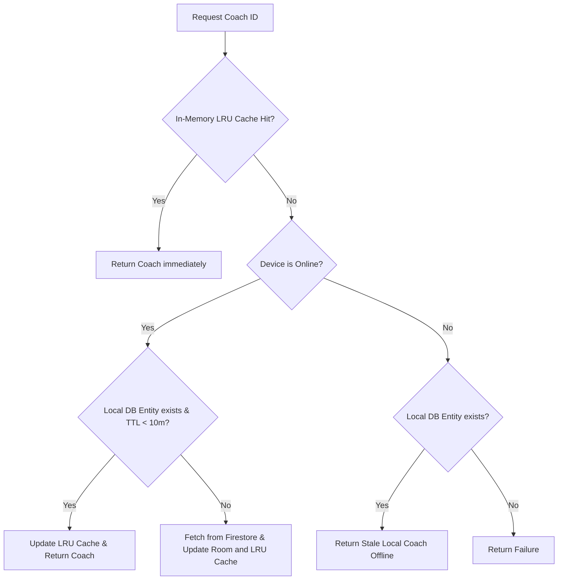

# Local Database & Key-Value Storage: Persistent Storage Decisions

## 1. Overview
The Coach Comparison feature utilizes two forms of local storage to persist data across application sessions:
1. **Local Relational Database (Room)**: Stores downloaded coach profiles persistently, providing rapid caching via a **10-minute Time-To-Live (TTL)** check and enabling absolute offline fallback capabilities.
2. **Key-Value Preference Storage (SharedPreferences)**: Stores user UI state preferences and comparison history exclusively for the coach comparison screen.

---

## 2. Room Database Design (Relational DB)

### Room Entity
The [CachedProfesorEntity](file:///c:/Users/juli2/StudioProjects/uniandesSports-Kotlin/app/src/main/java/com/uniandes/sport/data/local/ProfesoresCacheEntities.kt) maps the `Profesor` model to an SQLite table and includes a `cachedAt` timestamp to verify TTL:

```kotlin
@Entity(tableName = "cached_profesores")
data class CachedProfesorEntity(
    @PrimaryKey val id: String,
    val nombre: String,
    val photoUrl: String,
    val deporte: String,
    val rating: Double,
    val totalReviews: Int,
    val precio: String,
    val experiencia: String,
    val whatsapp: String,
    val disponibilidad: String,
    val especialidad: String,
    val verified: Boolean,
    val sessionsDelivered: Int,
    val tournamentWins: Int,
    val rankInSport: Int,
    val totalCoachesInSport: Int,
    val cachedAt: Long
)
```

### Room DAO Operations
In [ProfesoresCacheDao](file:///c:/Users/juli2/StudioProjects/uniandesSports-Kotlin/app/src/main/java/com/uniandes/sport/data/local/ProfesoresCacheDao.kt), we declare relational queries to search and retrieve profiles by ID:

```kotlin
@Dao
interface ProfesoresCacheDao {
    @Query("SELECT * FROM cached_profesores WHERE id = :id")
    suspend fun getProfesorById(id: String): CachedProfesorEntity?

    @Insert(onConflict = OnConflictStrategy.REPLACE)
    suspend fun upsertProfesores(items: List<CachedProfesorEntity>)
}
```

---

## 3. Storage Decision Logic (Room TTL)

The decision tree inside the [CoachComparisonRepository](file:///c:/Users/juli2/StudioProjects/uniandesSports-Kotlin/app/src/main/java/com/uniandes/sport/repositories/CoachComparisonRepository.kt) decides when to retrieve from local database vs Firestore remote storage:



### Time-To-Live (TTL) Calculation:
```kotlin
val isFresh = localCacheEntity != null && (System.currentTimeMillis() - localCacheEntity.cachedAt < 10 * 60 * 1000L)
```

---

## 4. SharedPreferences Storage (Key-Value Preferences)

To store user states and session options **exclusively for the Coach Comparison feature**, we implemented [CoachComparisonPreferences](file:///c:/Users/juli2/StudioProjects/uniandesSports-Kotlin/app/src/main/java/com/uniandes/sport/data/local/CoachComparisonPreferences.kt) using Android's `SharedPreferences` framework.

### Preference Configurations:
* **File Name**: `coach_comparison_prefs`
* **Keys**:
  1. `last_compared_ids` (String): Comma-separated list of coach IDs from the last successful comparison.
  2. `highlight_optimal` (Boolean): Boolean indicating if the UI should highlight optimal selections (best price, rating, experience, rank) with glowing borders and badges.

### Code Snippet:
```kotlin
object CoachComparisonPreferences {
    private fun prefs(context: Context) =
        context.getSharedPreferences("coach_comparison_prefs", Context.MODE_PRIVATE)

    fun saveLastComparedIds(context: Context, idsCsv: String) {
        prefs(context).edit().putString("last_compared_ids", idsCsv).apply()
    }

    fun getLastComparedIds(context: Context): String =
        prefs(context).getString("last_compared_ids", "") ?: ""

    fun saveHighlightOptimal(context: Context, highlight: Boolean) {
        prefs(context).edit().putBoolean("highlight_optimal", highlight).apply()
    }

    fun getHighlightOptimal(context: Context): Boolean =
        prefs(context).getBoolean("highlight_optimal", true)
}
```

### UI & ViewModel Integrations:
1. **ViewModel History Storing**: Upon launching a comparison in [CoachComparisonViewModel](file:///c:/Users/juli2/StudioProjects/uniandesSports-Kotlin/app/src/main/java/com/uniandes/sport/viewmodels/profesores/CoachComparisonViewModel.kt), we call:
   ```kotlin
   CoachComparisonPreferences.saveLastComparedIds(getApplication(), coachIdsStr)
   ```
2. **Interactive UI Switch**: In [CoachComparisonScreen](file:///c:/Users/juli2/StudioProjects/uniandesSports-Kotlin/app/src/main/java/com/uniandes/sport/ui/screens/tabs/CoachComparisonScreen.kt), we fetch the preference state and render an interactive `Switch` labeled "Highlights". Changing the switch state writes the new setting to `SharedPreferences` in real-time:
   ```kotlin
   Switch(
       checked = highlightOptimal,
       onCheckedChange = {
           highlightOptimal = it
           CoachComparisonPreferences.saveHighlightOptimal(context, it)
       }
   )
   ```

---

## 5. How to Test Persistent Storage

1. **Testing Room Database**:
   * Navigate to compare coaches while online. Check logs for Firestore download.
   * Open the screen again. Verification passes when the logs confirm a local SQLite/Room hit: `Local DB HIT (fresh < 10m)`.
   * Turn off Wi-Fi/data. Open comparison again. Verification passes when the offline fallback banner appears.

2. **Testing SharedPreferences (KV Store)**:
   * Open the comparison screen. The highlights are enabled by default (cells have green/yellow/blue/purple borders and badges).
   * Toggle the **Highlights** Switch in the header to **OFF**.
   * **Verification**: All cell borders and optimal badges disappear instantly, rendering a flat, plain table.
   * Exit the screen (press back) and open the comparison matrix again.
   * **Verification**: The switch remains **OFF** and highlights remain disabled, proving that SharedPreferences successfully persisted the user setting across screen sessions.
