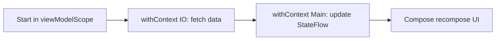
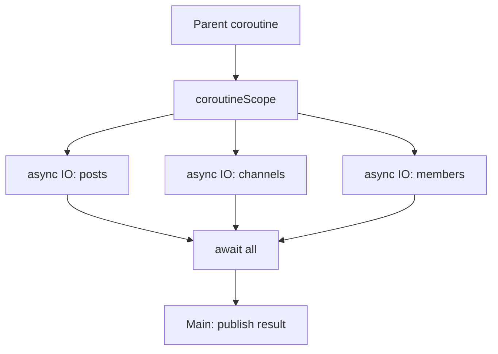
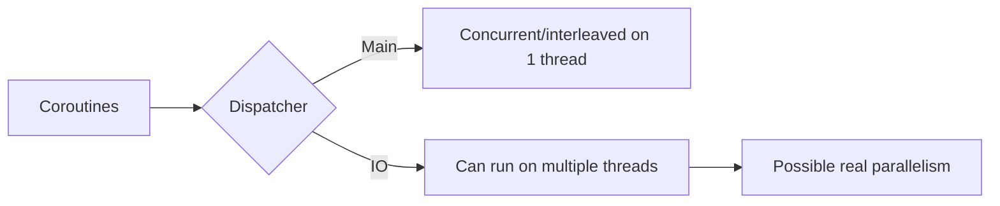

# Rubrica de Corutinas - Social Screen (Guia Rapida)

## 1) Idea clave: corutina vs hilo

Una corutina NO es un hilo.

- Hilo: recurso del sistema operativo (mas pesado).
- Corutina: tarea liviana que Kotlin puede pausar/reanudar.
- Dispatcher: decide en que hilo(s) corre la corutina.

Regla practica:

- `Dispatchers.Main`: UI (un solo hilo principal).
- `Dispatchers.IO`: red, base de datos, archivos (pool de hilos).
- `Dispatchers.Default`: trabajo de CPU.

Entonces, si preguntas "ocurren en paralelo?":

- Pueden correr en paralelo si el dispatcher usa varios hilos (ejemplo IO).
- Tambien pueden ser solo concurrentes (intercaladas) y no paralelas reales.

---

## 2) Lo minimo que te pide la rubrica

### Punto A - Corutina con un dispatcher (5)
Debes mostrar una corrutina con dispatcher explicito.

Codigo real en tu proyecto:

- Ubicacion: [app/src/main/java/com/uniandes/sport/viewmodels/communities/FirestoreCommunitiesViewModel.kt#L88](app/src/main/java/com/uniandes/sport/viewmodels/communities/FirestoreCommunitiesViewModel.kt#L88)

```bash
init {
    // A: corrutina con dispatcher.
    // Se carga cache de Room en IO para no bloquear el hilo principal.
    viewModelScope.launch(Dispatchers.IO) {
        val cached = cacheDao.getCachedCommunities().map { it.toModel() }
        withContext(Dispatchers.Main) {
            if (cached.isNotEmpty()) _communities.value = cached
        }
    }
}
```

Que decir en sustentacion:

"Uso `Dispatchers.IO` para mover Input/Output fuera del hilo principal y evitar congelar la UI".

### Punto B - Multiples corrutinas, una dentro de otra, usando IO (10)
Debes mostrar corrutina externa + corrutinas internas en paralelo con `async`.

Codigo real en tu proyecto:

- Ubicacion de metodo: [app/src/main/java/com/uniandes/sport/viewmodels/communities/FirestoreCommunitiesViewModel.kt#L180](app/src/main/java/com/uniandes/sport/viewmodels/communities/FirestoreCommunitiesViewModel.kt#L180)
- Bloque de corrutinas anidadas: [app/src/main/java/com/uniandes/sport/viewmodels/communities/FirestoreCommunitiesViewModel.kt#L199](app/src/main/java/com/uniandes/sport/viewmodels/communities/FirestoreCommunitiesViewModel.kt#L199)

```bash
// Corrutina externa + corrutinas internas async(IO) en paralelo.
val remotePayload = coroutineScope {
    val postsDeferred = async(Dispatchers.IO) {
        db.collection("communities").document(communityId)
            .collection("posts").get().await()
            .documents.mapNotNull { doc ->
                val p = doc.toObject(Post::class.java)
                p?.copy(id = doc.id)
            }.sortedByDescending { it.createdAt }
    }

    val channelsDeferred = async(Dispatchers.IO) {
        db.collection("communities").document(communityId)
            .collection("channels").get().await()
            .documents.mapNotNull { doc ->
                val ch = doc.toObject(Channel::class.java)
                ch?.copy(id = doc.id)
            }
    }

    val membersDeferred = async(Dispatchers.IO) {
        db.collection("communities").document(communityId)
            .collection("members").get().await()
            .documents.mapNotNull { doc ->
                val member = doc.toObject(CommunityMember::class.java)
                member?.copy(
                    id = doc.id,
                    userId = if (member.userId.isBlank()) doc.id else member.userId,
                    displayName = if (member.displayName.isBlank()) "Miembro" else member.displayName
                )
            }.sortedBy { it.displayName.lowercase() }
    }

    CommunityDetailsPayload(
        posts = postsDeferred.await(),
        channels = channelsDeferred.await(),
        members = membersDeferred.await()
    )
}
```

Que decir en sustentacion:

"Tengo una corrutina padre y tres hijas en IO. Se lanzan en paralelo logico y sincronizo con `await()`".

### Punto C - Una en IO y una en Main (10)
Debes mostrar que separas datos (IO) y render/estado (Main).

Codigo real en tu proyecto:

- IO cache: [app/src/main/java/com/uniandes/sport/viewmodels/communities/FirestoreCommunitiesViewModel.kt#L186](app/src/main/java/com/uniandes/sport/viewmodels/communities/FirestoreCommunitiesViewModel.kt#L186)
- Main cache -> UI: [app/src/main/java/com/uniandes/sport/viewmodels/communities/FirestoreCommunitiesViewModel.kt#L193](app/src/main/java/com/uniandes/sport/viewmodels/communities/FirestoreCommunitiesViewModel.kt#L193)
- Main remoto -> UI: [app/src/main/java/com/uniandes/sport/viewmodels/communities/FirestoreCommunitiesViewModel.kt#L240](app/src/main/java/com/uniandes/sport/viewmodels/communities/FirestoreCommunitiesViewModel.kt#L240)

```bash
val cachedPayload = withContext(Dispatchers.IO) {
    CommunityDetailsPayload(
        posts = cacheDao.getPostsByCommunity(communityId).map { it.toModel() },
        channels = cacheDao.getChannelsByCommunity(communityId).map { it.toModel() },
        members = cacheDao.getMembersByCommunity(communityId).map { it.toModel() }
    )
}

withContext(Dispatchers.Main) {
    if (cachedPayload.posts.isNotEmpty()) _posts.value = cachedPayload.posts
    if (cachedPayload.channels.isNotEmpty()) _channels.value = cachedPayload.channels
    if (cachedPayload.members.isNotEmpty()) _members.value = cachedPayload.members
}

withContext(Dispatchers.Main) {
    _posts.value = remotePayload.posts
    _channels.value = remotePayload.channels
    _members.value = remotePayload.members
}
```

Que decir en sustentacion:

"Leo datos en IO y publico estado en Main para mantener UI reactiva y segura".

---

## 3) Como mapear esto a tu Social ViewModel

Archivo: `app/src/main/java/com/uniandes/sport/viewmodels/communities/FirestoreCommunitiesViewModel.kt`

- Punto A: [init con dispatcher IO](app/src/main/java/com/uniandes/sport/viewmodels/communities/FirestoreCommunitiesViewModel.kt#L88)
- Punto B: [loadCommunityDetails con coroutineScope + async](app/src/main/java/com/uniandes/sport/viewmodels/communities/FirestoreCommunitiesViewModel.kt#L180)
- Punto C: [withContext IO/Main en el detalle](app/src/main/java/com/uniandes/sport/viewmodels/communities/FirestoreCommunitiesViewModel.kt#L186)

---

## 4) Diagramas (para entender rapido)

## Diagrama 1 - Flujo IO -> Main



## Diagrama 2 - Corrutinas anidadas



## Diagrama 3 - Concurrencia vs paralelo



---

## 5) Guion completo para sustentacion (3-5 min)

## Apertura (20-30s)

"Voy a mostrar tres cosas que pide la rubrica en Social: corrutina con dispatcher, corrutinas anidadas en IO, y separacion IO/Main. Todo esta implementado en mi ViewModel de Communities y lo voy a demostrar en codigo real".

## Bloque 1 - Dispatcher explicito (40-60s)

Abre: [app/src/main/java/com/uniandes/sport/viewmodels/communities/FirestoreCommunitiesViewModel.kt#L88](app/src/main/java/com/uniandes/sport/viewmodels/communities/FirestoreCommunitiesViewModel.kt#L88)

Que decir:

- "Aqui uso `viewModelScope.launch(Dispatchers.IO)` para cargar cache de Room en background".
- "Con `withContext(Dispatchers.Main)` publico `_communities` en el hilo de UI".
- "Esto evita bloquear render y cumple el punto de dispatcher explicito".

## Bloque 2 - Corrutinas anidadas en paralelo logico (70-90s)

Abre: [app/src/main/java/com/uniandes/sport/viewmodels/communities/FirestoreCommunitiesViewModel.kt#L199](app/src/main/java/com/uniandes/sport/viewmodels/communities/FirestoreCommunitiesViewModel.kt#L199)

Que decir:

- "Estoy dentro de una corrutina padre (`viewModelScope.launch`) y creo un `coroutineScope`".
- "Lanzo tres corrutinas hijas con `async(Dispatchers.IO)` para posts, channels y members".
- "Cada hija hace I/O independiente; luego sincronizo con `await()`".
- "Esto muestra concurrencia estructurada: si falla una hija, falla el scope y manejo el error en el `catch`".

## Bloque 3 - IO y Main claramente separados (60-80s)

Abre: [app/src/main/java/com/uniandes/sport/viewmodels/communities/FirestoreCommunitiesViewModel.kt#L186](app/src/main/java/com/uniandes/sport/viewmodels/communities/FirestoreCommunitiesViewModel.kt#L186)

Que decir:

- "Primero `withContext(Dispatchers.IO)` para leer cache local".
- "Luego `withContext(Dispatchers.Main)` para actualizar `_posts`, `_channels`, `_members`".
- "Repito publicacion en Main con payload remoto para refrescar UI cuando llegue Firebase".
- "Esto cumple seguridad de hilo para estado observado por Compose".

## Cierre tecnico (20-30s)

"La estrategia final es cache-first + remote-refresh: respuesta rapida al usuario, trabajo pesado en IO, y estado/UI en Main. Asi cumplo la rubrica y una arquitectura reactiva estable".

---

## 6) Demo paso a paso (que abrir y en que orden)

1. Abre [app/src/main/java/com/uniandes/sport/viewmodels/communities/FirestoreCommunitiesViewModel.kt#L88](app/src/main/java/com/uniandes/sport/viewmodels/communities/FirestoreCommunitiesViewModel.kt#L88) y explica dispatcher + Main.
2. Salta a [app/src/main/java/com/uniandes/sport/viewmodels/communities/FirestoreCommunitiesViewModel.kt#L186](app/src/main/java/com/uniandes/sport/viewmodels/communities/FirestoreCommunitiesViewModel.kt#L186) y explica IO/Main.
3. Salta a [app/src/main/java/com/uniandes/sport/viewmodels/communities/FirestoreCommunitiesViewModel.kt#L199](app/src/main/java/com/uniandes/sport/viewmodels/communities/FirestoreCommunitiesViewModel.kt#L199) y explica async/await.
4. Muestra donde publicas el remoto en Main en [app/src/main/java/com/uniandes/sport/viewmodels/communities/FirestoreCommunitiesViewModel.kt#L240](app/src/main/java/com/uniandes/sport/viewmodels/communities/FirestoreCommunitiesViewModel.kt#L240).
5. Si te piden efecto en UI, menciona que esos `StateFlow` los consume la screen Social y se recompone sin bloqueo.

---

## 7) Preguntas que te puede hacer la profe (con respuesta)

### "Si usas corutinas, eso significa que creas un hilo por cada una?"
No. Corutina != hilo. El dispatcher decide el hilo real. En IO se reutiliza un pool, no se crea un hilo fijo por corutina.

### "Donde hay paralelo real y donde solo concurrencia?"
En Main hay concurrencia intercalada en 1 hilo. En `async(Dispatchers.IO)` puede haber paralelo real porque IO usa varios hilos.

### "Por que no haces todo en Main si igual funciona?"
Porque I/O en Main puede congelar UI y causar jank/ANR. Main se reserva para publicar estado y render.

### "Que ventaja te da `coroutineScope` frente a lanzar 3 `launch` sueltos?"
`coroutineScope` + `async/await` da concurrencia estructurada: control de ciclo de vida, sincronizacion clara y propagacion de errores.

### "Como garantizas que la UI muestre algo rapido?"
Con cache-first: primero Room en IO y se publica en Main; despues llega red y refresca.

### "Que pasa si una consulta remota falla?"
El error cae en `catch`, se registra con `Log.e`, y no se bloquea la app. Además ya hubo intento de mostrar cache local.

---

## 8) Checklist final antes de entregar

1. Mostrar en codigo al menos un `launch(Dispatchers.IO)`.
2. Mostrar `coroutineScope + async(IO) + await()`.
3. Mostrar `withContext(IO)` y `withContext(Main)`.
4. Explicar por que Main no debe hacer IO.
5. Confirmar que la UI no se congela al cargar.
