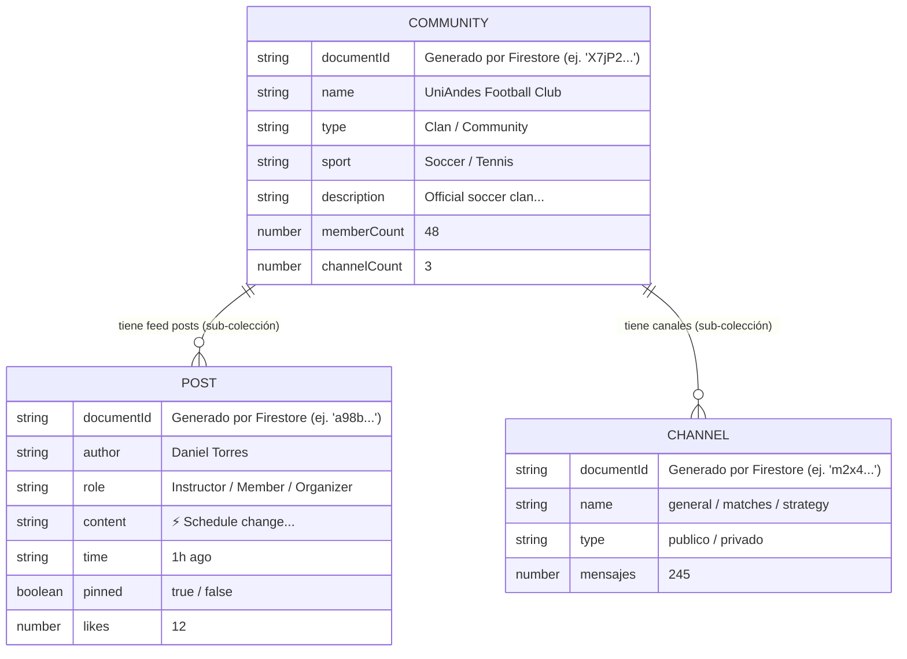

# Estructura de Firestore para Comunidades

A continuación puedes ver un diagrama de cómo quedó estructurada la colección `communities` y sus subcolecciones dentro de Cloud Firestore, basándonos en los datos que el [DatabaseSeeder.kt](file:///c:/Users/juanf/U/S7/1_moviles/uniandesSports-Kotlin/app/src/main/java/com/uniandes/sport/DatabaseSeeder.kt) inyectó.

### Explicación de la Jerarquía en Firestore

1. **`communities` (Colección Raíz)**
   - Contiene un documento por cada comunidad o clan.
   - En este documento se guarda toda la información general que se enumera en la tarjeta de la sección "Trending Now" o la lista filtrada de la vista Principal.
   
2. **`posts` (Sub-colección de cada comunidad)**
   - Ruta: `communities/{communityId}/posts`
   - Aquí viven todos los mensajes del "Feed" de esa comunidad en específico.
   - Ideal para poder hacer queries a futuro como *"Tráeme los últimos 10 posts ordenados por fecha de la comunidad X"*.
   
3. **`channels` (Sub-colección de cada comunidad)**
   - Ruta: `communities/{communityId}/channels`
   - Guarda los canales de chat específicos de ese grupo (ej. General, Partidos).

Esta estructura asegura que al cargar la pantalla principal (lista de comunidades), **solo traigas los datos básicos (la metadata)** de los grupos, y no el peso adicional de leer miles de posts o mensajes al mismo tiempo, lo que ahorra lecturas de base de datos (y dinero mensual en tu proyecto de Firebase). Solo se cargan los *posts* y *channels* cuando el usuario entra específicamente al detalle de una comunidad.
